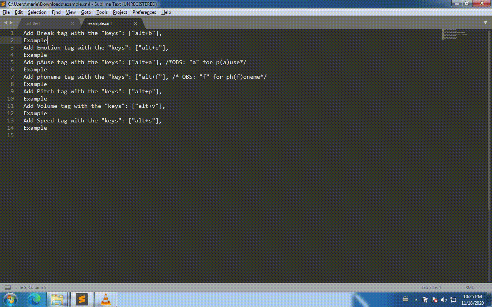

- [Description](#Description)
- [Source](#Source)
- [Installation](#Installation)
- [Usage](#Usage)
- [List of shortcuts](#Shortcuts)
# Description

Writing a vtml file can be repetitive. This repository contains [vtml-tag](https://docplayer.net/28913658-Vtml-voicetext-markup-language-tag-set.html) shortcuts for [Sublime 3 text editor.](https://www.sublimetext.com)

## Source 

In the current repository you will find
* "Default (Windows).sublime-keymap", the sublime user specific file that lists the shortcuts to use
* "vtml" folder contains files written in the Sublime scripting language and that are able to trigger the shortcuts.
* "demo.gif" a short demo file.
* "Installation.mp4" a movie that shows how to install this package.

## Installation 

1) Make sure you have downloaded and extracted the "vtml" folder and the "Default (Windows).sublime-keymap" file.

2) Open Sublime, copy/paste the content of "Default (Windows).sublime-keymap"
into "Preferences>Key Bindings". Save it.

3) Open "Preferences>Browse Packages" and paste the "vtml" folder into your sublime user folder
 
## Usage

1) Open a file in Sublime and save it with an XML extension. For instance "example.xml"

2) Select words you want to surround with tags

3) Use the appropriate shortcuts, for instance "Alt+v" for a vtml_volume tag.

## Shortcuts:
* Vtml-break:
alt+b
* Vtml-emotion:
alt+e
* Vtml-pause:
alt+a
* Vtml-phoneme:
alt+f
* Vtml-volume:
alt+v
* Vtml-pitch:
alt+p
* Vtml-speed:
alt+s

Good luck!

Author: [Marie Dubremetz](https://github.com/mardub1635)
